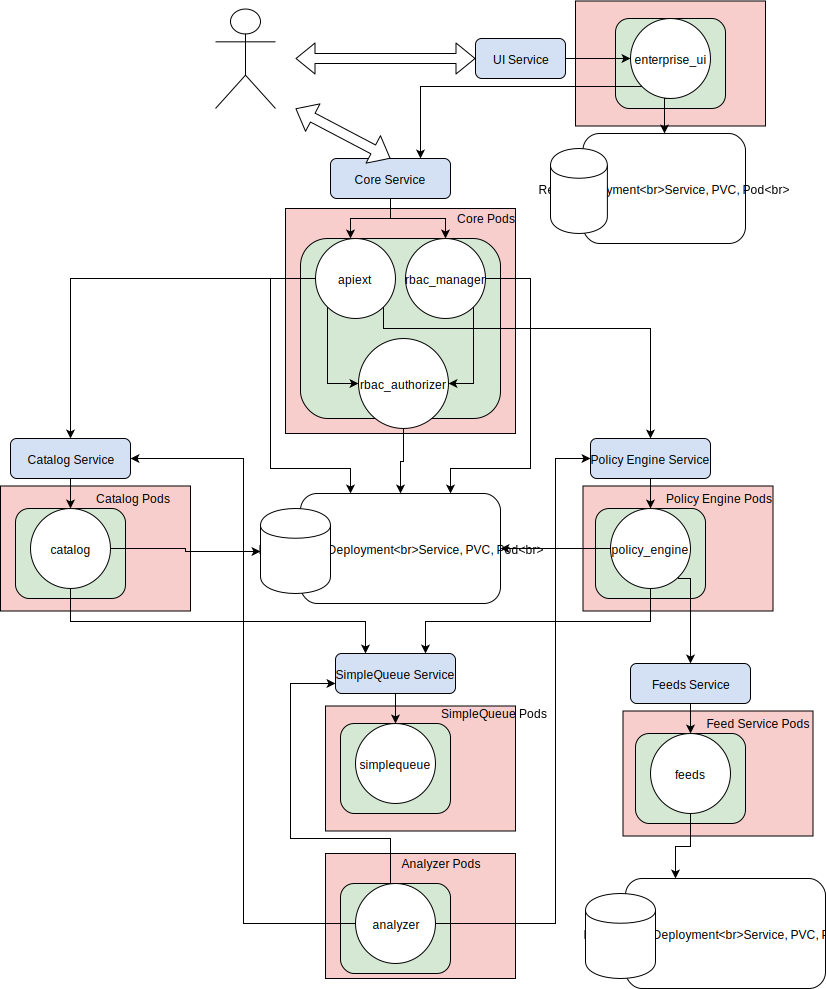

This document reviews the overall architecture of a full Anchore Enterprise deployment. With Anchore Enterprise, not all services/features are required, but for the purposes of this document, all services and features are enable and installed.

### Clients

#### Enterprise UI

The Enterprise UI is a proprietary UI for interacting with both the open-source Anchore Engine as well as enterprise extensions like role-based access-control. The UI depends on Redis to provide session state storage in memory and to act as a cache. Requires a valid Anchore Enterprise license to start an run.

##### Consumes

- Engine API
- Enterprise RBAC Manager API

##### Requires

- Redis
- Valid Enterprise License

#### Anchore Engine CLI

The open-source Anchore CLI is the primary command line interface to Anchore Engine and interfaces with the Engine API. See: Anchore CLI on Github

##### Consumes

- Engine API

### User-Facing API Services

#### Engine API

The Anchore Engine API is the primary API for the entire system. This service runs the API used to analyze images, get policy evaluations etc. In Enterprise installations, it is enhanced with an authorization plugin to provide role-based access-control (rbac) of resources and actions in addition to the standard account and user management features of the open-source Engine.

##### Consumes

- Catalog
- RBAC Authorizer
- Policy Engine
- SimpleQueue

##### Requires

- Anchore Engine DB

#### Enterprise RBAC Manager

The RBAC manager is the user-facing API for configuring the roles and assigning users to roles in the system. The API served by this component is also rbac-enabled. Requires a valid Anchore Enterprise license to start an run.

##### Consumes

- RBAC Authorizer

##### Requires

- Anchore Enterprise DB
- Valid Enterprise License

#### Enterprise RBAC Authorizer

This is not a user-facing component, but is consumed by both the Engine API and Enterprise RBAC Manager services to serving their APIs, so it lives in this tier. The Authorizer is an internal component that provides authorization decisions to the other API services and uses the Anchore Enteprise DB for persistence, as does the RBAC Manager. Requires a valid Anchore Enterprise license to start an run.

##### Requires

- Anchore Enterprise DB
- Valid Enterprise License

### State Management

#### Catalog

The catalog is the primary state manager of the system and owns both the state machines for images as well as the document archive interface used to store large, unstructured documents like JSON outputs from analysis. 

##### Consumes

- Policy Engine
- SimpleQueue

##### Requires

- Anchore Engine DB

#### Policy Engine

The policy engine is responsible for loading the result of an image analysis and normalizing and structuring the data in a way that makes it quickly saearchable, scans for vulnerabilities in the found artifacts of the image, and provides fast policy evaluation over that data. 

##### Consumes

- Catalog (for archive fetch)
- Enterprise Feed Service (in an enterprise install, for open-source it uses the hosted Anchore feed service at ancho.re)

##### Requires

- Anchore Engine DB

#### SimpleQueue

The simplequeue is a postgresql-backed queue service that the other components use for task execution, notifications, and other asynchronous operations.

##### Requires

- Anchore Engine DB

#### Enterprise Feed Service

The feed servuce component provides external vulnerability and package metadata to the policy engine for use in performing vulnerability scans and policy evaluations. It runs a set of drivers which each reach out to specific data sources to ingress the data from that source into a standard format that Anchore can consume. 

Requires a valid Anchore Enterprise license to start and run.

##### Requires

- Anchore Enterprise DB (shared with other enterprise components or using a different db instance)
- Valid Anchore Enterprise license

### Workers

#### Analyzer

The anchore engine analyzer is the component that does all of the image download and analysis heavy-lifting. It receives work from the simplequeue service by polling specific queues and executes image analysis, uploading the results to the catalog and the policy engine when complete.

##### Consumes

- Policy Engine
- SimpleQueue
- Catalog

##### Requires

- Anchore Engine DB

### Databases and Persistence

#### Anchore Engine Database

Anchore is built around a single Postgresql database, using the default public schema namespace. This is the standard open-source installed db and contains tables for all necessary services. The services do not communicate through the db, only through explicit API calls, but the database tables are consolidated for easier management operations.

#### Anchore Enterprise Database (a postgresql schema)

Anchore Enterprise has its own database tables and uses a separate anchore_enterprise schema namespace in the same postgresql database as the open-source installed tables. This schema has its own version tracking and upgrade mechanisms and includes the data for the RBAC systems as well as the Feed Service (if configured to use the same postgresql instance).

#### Feed Service Database
The feed service uses the same namespace/schema as the other enterprise components but can be configured to use an entirely different database instance if desired in order to isolate performance and load. This is particularly useful for air-gapped installations. The feed service uses the common Enterprise db upgrade mechanisms, if you install and configure the feed service to use its own db instance you will still see all the enterprise tables present, but they will not be used in that specific case.

#### Redis
Redis is a requirement of the Enterprise UI and is used for session state and caching. It is currently not expected to be persisted, only served from memory since that data is small.

### Deployment Topology and Inter-Service Communication

As an example of a production deployment topology, the Anchore Engine helm chart deploys the services in following topology:

