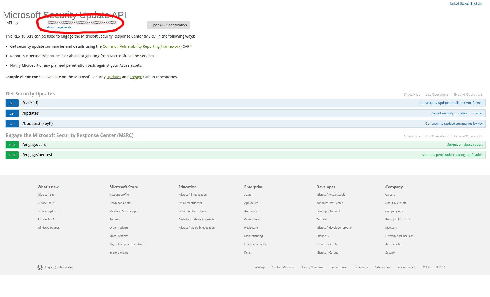

As of Enterprise 2.3.0, Anchore can analyze and provide vulnerability matches for Windows images. Anchore downloads, unpacks, and analyzes the windows image contents in a similar
way, it does Linux-based images, providing OS information as well as discovered application packages like npms, gems, python, NuGet, and java archives.

Vulnerabilities for Windows images are matched against the detected OS version and KBs detected installed in the image. These are matched using data from the Microsoft Security Research Center (MSRC) data API.

### Requirements

Analyzing windows images is supported out-of-the-box with no configuration changes, but to get vulnerability results, your deployment must:

1. Deploy an on-premises feed service
1. Have the _microsoft_ driver enabled in the feed service
1. The driver must have an API key configured for accessing Microsoft's MSRC vulnerability data API
1. The policy engine must have the _microsoft_ feed enabled to be synced from the feed service

***Note:*** Windows image analysis is not yet available for the tech preview Grype vulnerability scanner. It will be added in a future release.

### Configuring Microsoft Feeds

In the feed service configuration, enable the _msrc_ driver and provide an api_key.

```
services:
  feeds:
    ...
    drivers:
      ...
      msrc:
        enabled: true
        api_key: <api key string obtained from signing-up at https://portal.msrc.microsoft.com/en-us/developer>
```

Getting an API Key

1. Visit: https://portal.msrc.microsoft.com/en-us/developer
1. Create an account or sign-in with GitHub
1. Once logged-in, click 'Create New Key'
1. You should now see a screen with the title "Microsoft Security Update API". Directly below that is "API Key", click "Show" and copy that value into your configuration file. Example:




### Enabling the Feed in the Policy Engine

Once the feed service is configured to run the driver and fetch data from Microsoft, the policy engine must also be configured to pull that data from the feed service.

Ensure that your policy engine is using the on-premises feed service by checking the _url_ field in the _feeds_ configuration at the top level of the config.yaml on the policy engine(s).
This is typically configured for you in a Helm chart deployment, but for quickstarts with Docker Compose, you'll have to uncomment some lines to enable the feed service and configure the policy engine to use it. See the [Quickstart]() for details.


```
feeds:
  ...
  url: <ensure this is set to the URL to reach your deployed feed service>
  selective_sync:
    enabled: true
    feeds:
      ...
      microsoft: true
      ...
  ...
```


## Supported Windows Base Image Versions

The following are the MSRC Product IDs that Anchore can detect and provide vulnerability information for. These provide the basis for the main variants of the base
Windows containers: _Windows_, _ServerCore_, _NanoSerer_, and _IoTCore_


| Product ID | Name |
|------------|------|
| 10951 | Windows 10 Version 1703 for 32-bit Systems |
| 10952 | Windows 10 Version 1703 for x64-based Systems |
| 10729 | Windows 10 for 32-bit Systems |
| 10735 | Windows 10 for x64-based Systems |
| 10789 | Windows 10 Version 1511 for 32-bit Systems |
| 10788 | Windows 10 Version 1511 for x64-based Systems |
| 10852 | Windows 10 Version 1607 for 32-bit Systems |
| 10853 | Windows 10 Version 1607 for x64-based Systems |
| 11497 | Windows 10 Version 1803 for 32-bit Systems |
| 11498 | Windows 10 Version 1803 for x64-based Systems |
| 11563 | Windows 10 Version 1803 for ARM64-based Systems |
| 11568 | Windows 10 Version 1809 for 32-bit Systems |
| 11569 | Windows 10 Version 1809 for x64-based Systems |
| 11570 | Windows 10 Version 1809 for ARM64-based Systems |
| 11453 | Windows 10 Version 1709 for 32-bit Systems |
| 11454 | Windows 10 Version 1709 for x64-based Systems |
| 11583 | Windows 10 Version 1709 for ARM64-based Systems |
| 11644 | Windows 10 Version 1903 for 32-bit Systems |
| 11645 | Windows 10 Version 1903 for x64-based Systems |
| 11646 | Windows 10 Version 1903 for ARM64-based Systems |
| 11712 | Windows 10 Version 1909 for 32-bit Systems |
| 11713 | Windows 10 Version 1909 for x64-based Systems |
| 11714 | Windows 10 Version 1909 for ARM64-based Systems |
| 10379 | Windows Server 2012 (Server Core installation) |
| 10543 | Windows Server 2012 R2 (Server Core installation) |
| 10816 | Windows Server 2016 |
| 11571 | Windows Server 2019 |
| 10855 | Windows Server 2016  (Server Core installation) |
| 11572 | Windows Server 2019  (Server Core installation) |
| 11499 | Windows Server, version 1803  (Server Core Installation) |
| 11466 | Windows Server, version 1709  (Server Core Installation) |
| 11647 | Windows Server, version 1903 (Server Core installation) |
| 11715 | Windows Server, version 1909 (Server Core installation) |


### Windows OS Packages

Just as Linux images are scanned for packages such as RPMs, DPKG, and APK, Windows images are scanned for the installed components and Knowlege Base patches (KBs). When listing OS content on a Windows image, the results returned are KB identifiers that are numeric. Both the name and version will
be identical and are the KB IDs.


