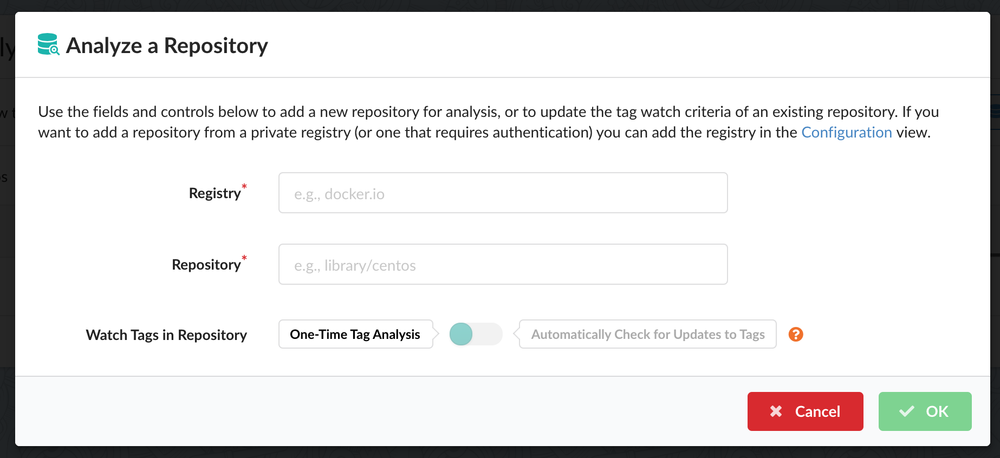
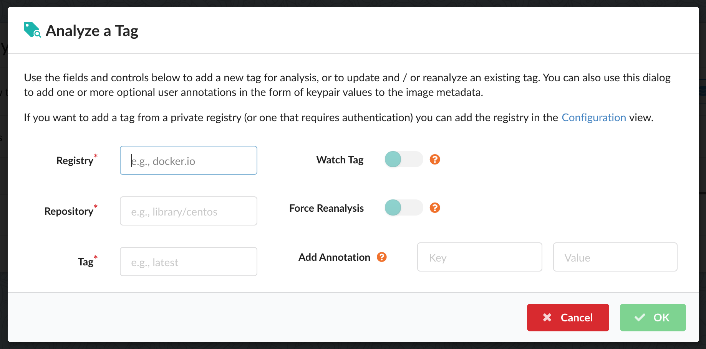

## Introduction

In this section you will learn how to conduct analysis on images in the Anchore Enterprise UI.

### Getting Started

After a successful login, navigate to the Image Analysis tab on the main menu.

On the right-hand side of the page, you will see two analyze options.

### Analyze a Repository

Upon selecting **Analyze Repository**, a modal will appear:

A couple items will be required:

- Registry (e.g. docker.io)
- Repository (e.g. library/centos)

An additional option to set the watch behavior is provided below. By default, all current tags will be analyzed but the repository will not be watched. Sliding the toggle to the right enables monitoring the repo for new tag additions.

Once you click ‘OK’, the repository will be flagged for analysis and a cycler will update your view every so often.

### Analyze a Tag

Upon selecting **Analyze Tag**, a modal will appear:

A few items will be required:

- Registry (e.g. docker.io)
- Repository (e.g. library/centos)
- Tag (e.g. latest)

If you’ve already navigated through to a specific registry, repository, or tag using the inline links, those editable fields will be pre-filled in with the relevant route info for your convenience.

A few additional options are also provided on the right:

- Watch Tag
  Enabling this allows monitoring the tag for image updates. Read more here.

- Force Reanalysis
  If the tag already exists, forcing re-analysis is available through this option. Will only be ignored in the case that the tag hasn’t yet been analyzed.

- Add Annotation
  Annotations are key-pair values added to the image metadata. They are viewable within the Overview page once the image has been analyzed as well as in the payload of any web hook notifications from Anchore Engine that contain image information.

**Note:** The Anchore Engine will attempt to download images from any registry without requiring further configuration. However, if your registry needs authentication then the corresponding credentials will need to be defined. See UI - Configuring Private Registries for more information.

For more details on the analysis process performed, refer to: Image Analysis Process.